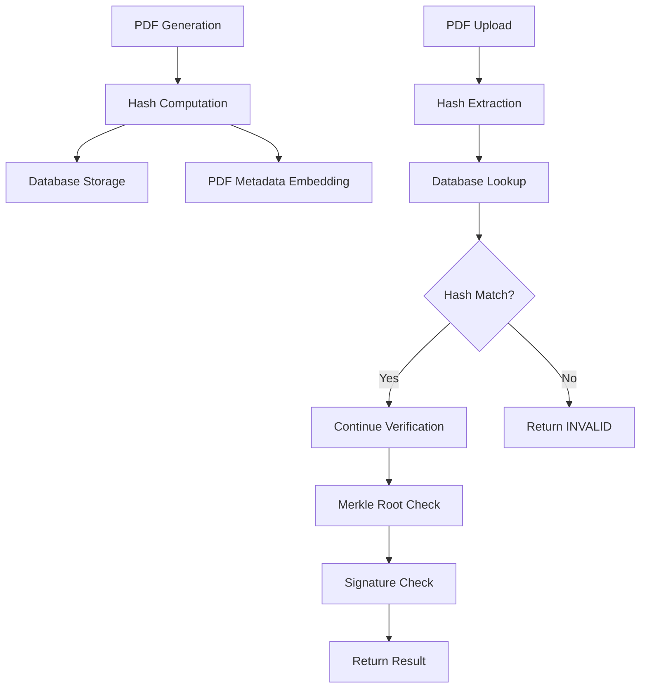

# Design Document

## Overview

This design implements cryptographic tamper detection for EduCerts certificate PDFs. The system will compute a SHA-256 hash of PDF content during issuance and signing, store it in the database, and validate it during verification. Any modification to the PDF content will result in a hash mismatch, causing verification to fail.

The solution integrates with the existing OpenAttestation-based verification system, adding an additional layer of content integrity checking that operates independently of the merkle root verification.

## Architecture

### High-Level Flow

```
Certificate Issuance:
1. Generate PDF with certificate data
2. Compute content hash (SHA-256 of text content)
3. Embed hash in PDF metadata
4. Store hash in database (certificates.content_hash)
5. Return certificate to issuer

Certificate Signing:
1. Apply signatures/stamps to PDF
2. Recompute content hash
3. Update hash in database
4. Update PDF metadata

Certificate Verification:
1. Extract certificate ID from PDF
2. Compute hash of uploaded PDF
3. Retrieve stored hash from database
4. Compare hashes
5. If match: proceed with other checks
6. If mismatch: return INVALID status
```

### Component Interaction



## Components and Interfaces

### 1. PDF Hash Utility Module (`pdf_hash_utils.py`)

New module for computing and validating PDF content hashes.

```python
def compute_pdf_content_hash(pdf_path: str) -> str:
    """
    Computes SHA-256 hash of PDF text content.
    
    Args:
        pdf_path: Path to the PDF file
        
    Returns:
        Hex string of SHA-256 hash
        
    Raises:
        ValueError: If PDF cannot be read or parsed
    """
    pass

def embed_hash_in_pdf_metadata(pdf_path: str, content_hash: str, cert_id: str) -> None:
    """
    Embeds content hash and cert ID in PDF metadata.
    
    Args:
        pdf_path: Path to the PDF file
        content_hash: SHA-256 hash to embed
        cert_id: Certificate UUID
    """
    pass

def extract_hash_from_pdf_metadata(pdf_path: str) -> dict:
    """
    Extracts embedded hash and cert ID from PDF metadata.
    
    Returns:
        Dict with keys: 'content_hash', 'cert_id'
    """
    pass

def normalize_pdf_text(text: str) -> str:
    """
    Normalizes PDF text for consistent hashing.
    - Strips leading/trailing whitespace
    - Normalizes line endings to \n
    - Collapses multiple spaces to single space
    """
    pass
```

### 2. Database Schema Changes

Add `content_hash` column to the `certificates` table:

```python
# In models.py
class Certificate(Base):
    # ... existing fields ...
    content_hash = Column(String(64), nullable=True, index=True)
```

Migration script:
```sql
ALTER TABLE certificates ADD COLUMN content_hash VARCHAR(64);
CREATE INDEX idx_certificates_content_hash ON certificates(content_hash);
```

### 3. Modified Issuance Endpoint

Update `/api/issue` to compute and store hash:

```python
@app.post("/api/issue", response_model=schemas.Certificate)
def issue_certificate(cert_data: schemas.CertificateCreate, db: Session = Depends(get_db)):
    # ... existing PDF generation code ...
    
    if rendered_path:
        # Compute content hash
        content_hash = pdf_hash_utils.compute_pdf_content_hash(rendered_path)
        
        # Embed in PDF metadata
        pdf_hash_utils.embed_hash_in_pdf_metadata(
            rendered_path, 
            content_hash, 
            cert_id
        )
        
        # Store in database
        db_cert.content_hash = content_hash
    
    # ... rest of issuance logic ...
```

### 4. Modified Signing Endpoint

Update signature application to recompute hash:

```python
@app.post("/api/certificates/{cert_id}/sign")
def sign_certificate(...):
    # ... apply signatures to PDF ...
    
    # Recompute hash after signing
    new_hash = pdf_hash_utils.compute_pdf_content_hash(output_path)
    
    # Update database
    cert.content_hash = new_hash
    cert.signing_status = "signed"
    
    # Update PDF metadata
    pdf_hash_utils.embed_hash_in_pdf_metadata(
        output_path,
        new_hash,
        cert_id
    )
```

### 5. Enhanced Verification Endpoint

Update `/api/verify/pdf` to validate content hash:

```python
@app.post("/api/verify/pdf")
async def verify_pdf_certificate(file: UploadFile = File(...), db: Session = Depends(get_db)):
    content = await file.read()
    
    # Save to temp file for processing
    temp_path = f"temp_{uuid.uuid4()}.pdf"
    with open(temp_path, "wb") as f:
        f.write(content)
    
    try:
        # Extract cert ID
        cert_id = extract_cert_id_from_pdf(temp_path)
        
        # Compute hash of uploaded PDF
        uploaded_hash = pdf_hash_utils.compute_pdf_content_hash(temp_path)
        
        # Retrieve certificate from database
        cert = db.query(models.Certificate).filter(
            models.Certificate.id == cert_id
        ).first()
        
        if not cert:
            raise HTTPException(status_code=404, detail="Certificate not found")
        
        # Compare hashes
        is_content_valid = (uploaded_hash == cert.content_hash)
        
        # ... continue with other verification checks ...
        
        return {
            "summary": {
                "all": is_content_valid and other_checks,
                "contentIntegrity": is_content_valid,
                # ... other checks ...
            },
            "data": [
                {
                    "type": "CONTENT_INTEGRITY",
                    "name": "PDFContentHash",
                    "data": {
                        "expected": cert.content_hash,
                        "computed": uploaded_hash,
                        "match": is_content_valid
                    },
                    "status": "VALID" if is_content_valid else "INVALID"
                },
                # ... other verification data ...
            ]
        }
    finally:
        # Clean up temp file
        if os.path.exists(temp_path):
            os.remove(temp_path)
```

## Data Models

### Certificate Model Extension

```python
class Certificate(Base):
    __tablename__ = "certificates"
    
    # Existing fields...
    id = Column(String(36), primary_key=True, index=True)
    student_name = Column(String(200))
    course_name = Column(String(200))
    data_payload = Column(JSON)
    signature = Column(Text)
    rendered_pdf_path = Column(String(500), nullable=True)
    
    # NEW: Content hash for tamper detection
    content_hash = Column(String(64), nullable=True, index=True)
```

### Verification Response Schema

```python
class VerificationResponse(BaseModel):
    summary: dict  # {all, contentIntegrity, documentIntegrity, ...}
    data: List[dict]  # Detailed check results
    certificate: dict  # Certificate details
    
class ContentIntegrityCheck(BaseModel):
    type: str = "CONTENT_INTEGRITY"
    name: str = "PDFContentHash"
    data: dict  # {expected, computed, match}
    status: str  # "VALID" | "INVALID"
```

## Correctness Properties

*A property is a characteristic or behavior that should hold true across all valid executions of a system—essentially, a formal statement about what the system should do. Properties serve as the bridge between human-readable specifications and machine-verifiable correctness guarantees.*


### Property Reflection

Before defining properties, let's identify and eliminate redundancy:

**Redundant Properties Identified:**
- Properties 1.1 and 4.1 both test that hash is computed and stored during issuance - can be combined
- Properties 1.2 and 6.2 both test hash computation during upload verification - can be combined  
- Properties 1.3 and 1.5 both test tamper detection - 1.5 is more comprehensive
- Properties 2.1 and 2.2 both test metadata embedding - can be combined into one comprehensive property
- Properties 5.2 and 5.3 both test verification response structure - can be combined
- Properties 6.1 and 6.2 test two verification paths but can be unified under a single "verification works" property
- Properties 8.2 and 8.5 both test verification consistency - 8.5 (idempotence) subsumes 8.2

**Consolidated Property Set:**
After reflection, we'll define properties that provide unique validation value without logical redundancy.

### Correctness Properties

Property 1: Hash computation and storage during issuance
*For any* certificate data, when a PDF is generated during issuance, the system should compute a SHA-256 hash of the content and store it in the certificates.content_hash column
**Validates: Requirements 1.1, 4.1**

Property 2: Tamper detection through hash mismatch
*For any* issued certificate PDF and any modification to its text content, the computed hash of the modified PDF should differ from the stored hash, and verification should return INVALID status
**Validates: Requirements 1.3, 1.5**

Property 3: Hash comparison during verification
*For any* uploaded PDF, the verification system should compute its content hash and compare it to the stored hash for the certificate ID extracted from the PDF
**Validates: Requirements 1.2, 6.2**

Property 4: Unmodified certificates pass verification
*For any* certificate PDF that has not been modified after issuance, the computed hash should match the stored hash and verification should proceed with other checks
**Validates: Requirements 1.4**

Property 5: Metadata embedding completeness
*For any* generated certificate PDF, the system should embed both the content hash and certificate ID in the PDF metadata
**Validates: Requirements 2.1, 2.2**

Property 6: Metadata extraction during verification
*For any* certificate PDF with embedded metadata, the verification system should successfully extract the certificate ID and content hash from the metadata
**Validates: Requirements 2.3**

Property 7: Metadata tampering detection
*For any* certificate PDF, if the metadata is modified after issuance, the verification system should detect the tampering through signature validation
**Validates: Requirements 2.5**

Property 8: Multi-page content extraction
*For any* PDF with multiple pages, the hash computation should extract and include text content from all pages
**Validates: Requirements 3.1**

Property 9: Whitespace normalization consistency
*For any* two PDFs with identical text content but different whitespace or line endings, the system should produce identical content hashes
**Validates: Requirements 3.2, 3.4**

Property 10: Metadata-only changes preserve content hash
*For any* certificate PDF, if only metadata fields are modified (not content), the content hash should remain unchanged
**Validates: Requirements 3.5**

Property 11: Hash update after signing
*For any* certificate that undergoes digital signing, the system should recompute the content hash and update it in the database
**Validates: Requirements 4.2**

Property 12: Hash persistence after revocation
*For any* certificate that is revoked, the content_hash value should remain in the database unchanged
**Validates: Requirements 4.4**

Property 13: Hash inclusion in query responses
*For any* certificate query, the response should include the stored content_hash value
**Validates: Requirements 4.5**

Property 14: Verification response completeness
*For any* verification attempt (success or failure), the response should include all verification check results with their individual statuses, and for failures should include both expected and computed hashes
**Validates: Requirements 5.2, 5.3**

Property 15: Verification logging
*For any* verification attempt, the system should create a log entry with timestamp and result
**Validates: Requirements 5.5**

Property 16: Verification method consistency
*For any* certificate, verification by certificate ID and verification by PDF upload should return consistent results
**Validates: Requirements 6.5**

Property 17: Graceful hash computation failure
*For any* certificate issuance where hash computation fails, the system should log the error and continue with issuance without blocking
**Validates: Requirements 7.4**

Property 18: QR code presence in issued certificates
*For any* issued certificate PDF, the document should contain a verification link or QR code
**Validates: Requirements 8.1**

Property 19: Verification idempotence
*For any* certificate PDF, verifying it multiple times should return identical results each time
**Validates: Requirements 8.2, 8.5**

## Error Handling

### Hash Computation Errors

1. **PDF Parsing Failure**: If PyMuPDF cannot open the PDF, log error and return 400 with message "Invalid or corrupted PDF file"
2. **Empty Content**: If PDF has no extractable text, compute hash of empty string (deterministic behavior)
3. **Large Files**: For PDFs > 10MB, log warning but continue processing (no size limit enforcement)

### Verification Errors

1. **Missing Certificate ID**: Return 400 with "Could not find a valid Certificate ID in this PDF"
2. **Certificate Not Found**: Return 404 with "Certificate not found"
3. **Hash Mismatch**: Return verification response with contentIntegrity: false and detailed hash comparison
4. **Missing Stored Hash**: If database has no hash (legacy certificates), skip content integrity check and log warning

### Database Errors

1. **Migration Failure**: Provide rollback script and manual migration instructions
2. **Null Hash Values**: Treat as legacy certificates, allow verification to proceed with warning
3. **Duplicate Hashes**: Allow (multiple certificates can have identical content)

## Testing Strategy

### Unit Testing

Unit tests will cover:
- Hash computation function with various PDF inputs
- Text normalization function with edge cases (empty, whitespace-only, special characters)
- Metadata embedding and extraction functions
- Error handling for corrupted PDFs

### Property-Based Testing

We will use **Hypothesis** (Python property-based testing library) to implement the correctness properties defined above. Each property will be implemented as a separate test function.

**Configuration:**
- Minimum 100 iterations per property test
- Custom generators for certificate data, PDF content, and modifications
- Shrinking enabled to find minimal failing examples

**Test Tagging:**
Each property-based test will include a comment with the format:
```python
# Feature: cryptographic-certificate-verification, Property X: [property description]
```

**Key Generators:**
- `certificate_data_generator`: Generates random valid certificate data
- `pdf_modification_generator`: Generates random text modifications
- `whitespace_variant_generator`: Generates text with different whitespace patterns

### Integration Testing

Integration tests will verify:
- End-to-end issuance with hash computation
- End-to-end verification with hash validation
- Database schema migration
- API endpoint responses

### Edge Cases

Specific edge case tests:
- Empty PDFs
- PDFs with only images (no text)
- Very large PDFs (>10MB)
- PDFs with special characters and Unicode
- Corrupted PDF files
- Missing metadata
- Legacy certificates without hashes

## Performance Considerations

### Hash Computation Optimization

1. **Text Extraction**: Use PyMuPDF's efficient text extraction (faster than pdfplumber for large files)
2. **Caching**: Consider caching hashes for frequently verified certificates
3. **Async Processing**: For batch issuance, compute hashes asynchronously

### Database Indexing

```sql
CREATE INDEX idx_certificates_content_hash ON certificates(content_hash);
```

This index enables:
- Fast hash lookups during verification
- Efficient duplicate detection (if needed)
- Query optimization for audit reports

### Memory Management

- Stream large PDFs instead of loading entirely into memory
- Clean up temporary files immediately after processing
- Limit concurrent hash computations to prevent memory exhaustion

## Security Considerations

### Hash Algorithm Choice

SHA-256 provides:
- 256-bit security (computationally infeasible to find collisions)
- Fast computation (suitable for real-time verification)
- Wide industry adoption and trust

### Metadata Security

- Metadata can be modified, so don't rely solely on embedded hashes
- Always verify against database-stored hash as source of truth
- Consider signing metadata in future enhancement

### Attack Vectors

1. **Hash Collision Attack**: Extremely unlikely with SHA-256 (2^128 operations)
2. **Database Compromise**: If attacker modifies both PDF and database hash, tampering undetectable - mitigate with database access controls and audit logs
3. **Replay Attack**: Old valid certificate could be presented - mitigate with revocation checks
4. **Metadata Stripping**: Attacker removes metadata - system falls back to database lookup

## Migration Plan

### Database Migration

```python
# migrate_add_content_hash.py
from sqlalchemy import text
from database import engine

def upgrade():
    with engine.connect() as conn:
        conn.execute(text("""
            ALTER TABLE certificates 
            ADD COLUMN content_hash VARCHAR(64);
        """))
        conn.execute(text("""
            CREATE INDEX idx_certificates_content_hash 
            ON certificates(content_hash);
        """))
        conn.commit()

def downgrade():
    with engine.connect() as conn:
        conn.execute(text("""
            DROP INDEX IF EXISTS idx_certificates_content_hash;
        """))
        conn.execute(text("""
            ALTER TABLE certificates 
            DROP COLUMN content_hash;
        """))
        conn.commit()
```

### Backfilling Legacy Certificates

For existing certificates without hashes:

```python
# backfill_content_hashes.py
def backfill_hashes():
    certs = db.query(Certificate).filter(
        Certificate.content_hash == None,
        Certificate.rendered_pdf_path != None
    ).all()
    
    for cert in certs:
        if os.path.exists(cert.rendered_pdf_path):
            try:
                hash_val = compute_pdf_content_hash(cert.rendered_pdf_path)
                cert.content_hash = hash_val
                db.commit()
            except Exception as e:
                print(f"Failed to hash {cert.id}: {e}")
                continue
```

## Deployment Strategy

### Phase 1: Database Migration
- Run migration script to add content_hash column
- Verify schema changes in staging environment
- No downtime required (nullable column)

### Phase 2: Code Deployment
- Deploy new code with hash computation
- New certificates will have hashes
- Old certificates continue to work (null hash = skip check)

### Phase 3: Backfill (Optional)
- Run backfill script for legacy certificates
- Monitor for errors
- Can be done gradually over time

### Phase 4: Enforcement
- After sufficient backfill, consider making hash check mandatory
- Add monitoring for verification failures due to tampering
- Set up alerts for suspicious patterns

## Monitoring and Observability

### Metrics to Track

1. **Hash Computation Time**: P50, P95, P99 latencies
2. **Verification Failure Rate**: Track hash mismatch failures
3. **Legacy Certificate Rate**: Percentage of verifications with null hashes
4. **Error Rate**: Hash computation failures during issuance

### Logging

Log entries should include:
- Timestamp
- Certificate ID
- Operation (issue, sign, verify)
- Hash value (first 8 chars for brevity)
- Result (success/failure)
- Error details if applicable

### Alerts

Set up alerts for:
- Sudden spike in verification failures (possible attack)
- High hash computation error rate (system issue)
- Unusual patterns in tampered certificate attempts
